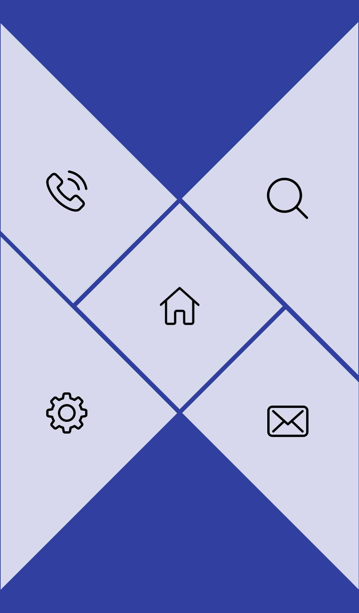

# PolygonView  [  ](https://bintray.com/pinocks/maven/polygonview/_latestVersion) [](https://travis-ci.org/pinocks/polygon-view)



For more information please see [the website][1]


# Download

grab via Gradle:
```groovy
implementation 'com.pinocks:polygonview:1.0.0'
```
or Maven:
```xml
<dependency>
  <groupId>com.pinocks</groupId>
  <artifactId>polygonview</artifactId>
  <version>1.0.0</version>
  <type>pom</type>
</dependency>
```

Snapshots of the development version are available in [Sonatype's `snapshots` repository][snap].


# Usage

```xml

    <com.pinocks.polygonview.PolygonView
        android:id="@+id/polygonview"
        android:layout_width="match_parent"
        android:layout_height="match_parent"
        app:buttonBottomLeftDrawable="@drawable/icon_1"
        app:buttonBottomRightDrawable="@drawable/icon_2"
        app:buttonCenterDrawable="@drawable/icon_3"
        app:buttonTopLeftDrawable="@drawable/icon_4"
        app:buttonTopRightDrawable="@drawable/icon_5"
        />

```

# Listener

Just add a listener to receive button interaction

```java
PolygonView polygonView = findViewById(R.id.polygonview);
polygonView.setPolygonViewEventListener(new PolygonViewEventListener() {
            @Override
            public void onClickCenterButton() {
                Toast.makeText(getApplicationContext(),"onClickCenterButton",Toast.LENGTH_SHORT).show();
            }

            @Override
            public void onClickTopLeftButton() {
                Toast.makeText(getApplicationContext(),"onClickTopLeftButton",Toast.LENGTH_SHORT).show();
            }

            @Override
            public void onClickTopRightButton() {
                Toast.makeText(getApplicationContext(),"onClickTopRightButton",Toast.LENGTH_SHORT).show();
            }

            @Override
            public void onClickBottomLeftButton() {
                Toast.makeText(getApplicationContext(),"onClickBottomLeftButton",Toast.LENGTH_SHORT).show();
            }

            @Override
            public void onClickBottomRightButton() {
                Toast.makeText(getApplicationContext(),"onClickBottomRightButton",Toast.LENGTH_SHORT).show();
            }
});
```

# Credits

Author: Manu K [http://www.manuknarayanan.com/](http://www.manuknarayanan.com/)

Blog : [http://www.manuknarayanan.com/blog](http://www.manuknarayanan.com/blog)


<a href="https://plus.google.com/+manuknarayanan">
  
</a>
<a href="https://twitter.com/manuknarayanan">
  
</a>
<a href="https://www.linkedin.com/in/manuknarayanan">
  
</a>


License
--------

    Copyright 2018 Pinocks Pvt. Ltd.

    Licensed under the Apache License, Version 2.0 (the "License");
    you may not use this file except in compliance with the License.
    You may obtain a copy of the License at

       http://www.apache.org/licenses/LICENSE-2.0

    Unless required by applicable law or agreed to in writing, software
    distributed under the License is distributed on an "AS IS" BASIS,
    WITHOUT WARRANTIES OR CONDITIONS OF ANY KIND, either express or implied.
    See the License for the specific language governing permissions and
    limitations under the License.


 [1]: http://pinocks.com
